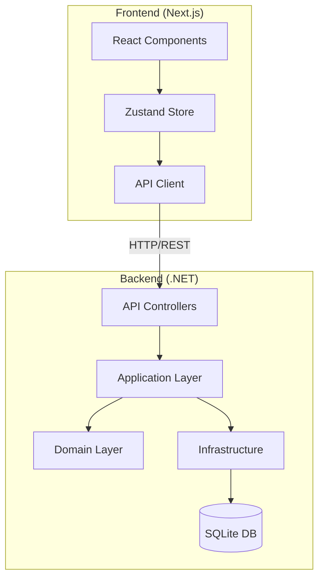

# Architecture Overview

## System Design

The Job Application Tracker follows a separated architecture pattern with distinct backend and frontend applications communicating via REST API.

## Backend Architecture (Clean Architecture)

### Layers

1. **Domain Layer** (`JobTracker.Domain`)
   - Core business entities
   - Domain interfaces
   - No external dependencies

2. **Application Layer** (`JobTracker.Application`)
   - CQRS commands and queries
   - Business logic and use cases
   - DTOs and mappings
   - MediatR handlers

3. **Infrastructure Layer** (`JobTracker.Infrastructure`)
   - Entity Framework Core implementation
   - External service integrations
   - Data persistence
   - Identity management

4. **API Layer** (`JobTracker.API`)
   - RESTful endpoints
   - Authentication/Authorization
   - Request/Response handling
   - Swagger documentation

### Key Patterns

- **CQRS**: Separate read and write operations
- **Repository Pattern**: Abstract data access
- **Unit of Work**: Transaction management
- **Dependency Injection**: IoC container

## Frontend Architecture

### Structure

1. **App Router** (`/app`)
   - File-based routing
   - Server components by default
   - Layout composition

2. **Components** (`/components`)
   - Reusable UI components
   - Follows compound component pattern
   - Tailwind CSS styling

3. **State Management**
   - Zustand for global state
   - React Query for server state
   - Local component state when appropriate

4. **API Integration**
   - Axios with interceptors
   - Automatic token refresh
   - Type-safe API clients

### Key Technologies

- **Next.js 15**: React framework with App Router
- **TypeScript**: Type safety
- **Tailwind CSS**: Utility-first styling
- **React Hook Form**: Form management
- **Zod**: Schema validation

## Data Flow

### Authentication Flow

1. User submits credentials
2. Backend validates and returns JWT tokens
3. Frontend stores tokens in Zustand (persisted)
4. Axios interceptor adds token to requests
5. Backend validates token on each request

### Data Operations

1. **Create/Update**:
   - Frontend form validation (Zod)
   - API request with typed payload
   - Backend command handler
   - Database operation
   - Response with updated entity

2. **Query**:
   - Frontend request with filters
   - Backend query handler
   - Optimized database query
   - DTO mapping
   - Paginated response

## Security

### Backend
- JWT Bearer authentication
- Role-based authorization
- Input validation
- SQL injection prevention
- CORS configuration

### Frontend
- Token storage in memory/localStorage
- Automatic token refresh
- XSS prevention
- CSRF protection
- Input sanitization

## Deployment Architecture

### Development
- Local SQLite database
- Hot reload for both services
- Docker Compose for consistency

### Production (Recommended)
- Backend: Container on AWS ECS/Azure App Service
- Frontend: Vercel/Netlify with CDN
- Database: PostgreSQL/SQL Server
- File Storage: S3/Azure Blob Storage

## Scalability Considerations

1. **Backend**
   - Stateless API design
   - Database connection pooling
   - Caching layer (Redis)
   - Horizontal scaling ready

2. **Frontend**
   - Static generation where possible
   - Image optimization
   - Code splitting
   - Edge caching

## Monitoring & Observability

1. **Logging**
   - Structured logging (Serilog)
   - Request/Response logging
   - Error tracking

2. **Metrics**
   - Application performance
   - Database query performance
   - API response times

3. **Health Checks**
   - Database connectivity
   - External service status
   - Application readiness