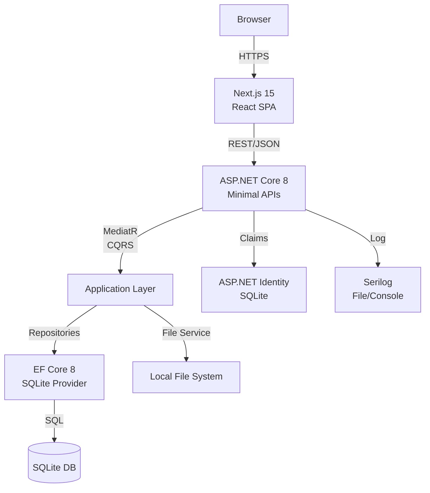

# Job Tracker - Local Storage Version (SQLite + File System)

> **Goal**: Modified architecture using SQLite and local file storage instead of SQL Server and S3/MinIO - perfect for free, localhost development.

## Updated Architecture

### Architecture Flow (Simplified)



## Key Changes from Original

### 1. Database: SQL Server → SQLite
- **Zero cost**, file-based database
- No Docker required
- Perfect for single-user/localhost
- Still uses Entity Framework Core

### 2. File Storage: S3/MinIO → Local File System
- Files stored in `wwwroot/uploads/` directory
- Metadata tracked in SQLite
- Direct file serving through ASP.NET Core static files

### 3. Simplified Infrastructure
- No Docker required (optional for consistency)
- No external services
- Single executable deployment

## Updated Database Schema (SQLite)

```sql
-- Users table (simplified from AspNetUsers)
CREATE TABLE users (
    id TEXT PRIMARY KEY,
    email TEXT UNIQUE NOT NULL,
    password_hash TEXT NOT NULL,
    full_name TEXT NOT NULL,
    created_at TEXT NOT NULL,
    updated_at TEXT NOT NULL
);

-- Job Applications
CREATE TABLE job_applications (
    id TEXT PRIMARY KEY,
    user_id TEXT NOT NULL,
    job_title TEXT NOT NULL,
    company_name TEXT NOT NULL,
    contact_email TEXT,
    contact_phone TEXT,
    is_remote INTEGER DEFAULT 0,
    self_sourced INTEGER DEFAULT 0,
    applied_date TEXT NOT NULL,
    status TEXT NOT NULL,
    notes TEXT,
    created_at TEXT NOT NULL,
    updated_at TEXT NOT NULL,
    FOREIGN KEY (user_id) REFERENCES users(id)
);

-- Interviews
CREATE TABLE interviews (
    id TEXT PRIMARY KEY,
    application_id TEXT NOT NULL,
    interview_date TEXT NOT NULL,
    interview_type TEXT NOT NULL,
    stage TEXT,
    interviewer TEXT,
    outcome TEXT,
    notes TEXT,
    created_at TEXT NOT NULL,
    FOREIGN KEY (application_id) REFERENCES job_applications(id)
);

-- File Uploads (stores metadata only)
CREATE TABLE uploads (
    id TEXT PRIMARY KEY,
    user_id TEXT NOT NULL,
    application_id TEXT,
    file_name TEXT NOT NULL,
    file_path TEXT NOT NULL,
    mime_type TEXT NOT NULL,
    file_size INTEGER NOT NULL,
    upload_type TEXT NOT NULL, -- 'resume', 'cover_letter', 'job_posting', etc.
    created_at TEXT NOT NULL,
    FOREIGN KEY (user_id) REFERENCES users(id),
    FOREIGN KEY (application_id) REFERENCES job_applications(id)
);

-- Resume Templates
CREATE TABLE resume_templates (
    id TEXT PRIMARY KEY,
    user_id TEXT NOT NULL,
    name TEXT NOT NULL,
    description TEXT,
    template_data TEXT NOT NULL, -- JSON
    created_at TEXT NOT NULL,
    FOREIGN KEY (user_id) REFERENCES users(id)
);

-- Generated Resumes
CREATE TABLE resumes (
    id TEXT PRIMARY KEY,
    template_id TEXT NOT NULL,
    file_path TEXT NOT NULL,
    created_at TEXT NOT NULL,
    FOREIGN KEY (template_id) REFERENCES resume_templates(id)
);

-- Create indexes
CREATE INDEX idx_job_applications_user_id ON job_applications(user_id);
CREATE INDEX idx_interviews_application_id ON interviews(application_id);
CREATE INDEX idx_uploads_user_id ON uploads(user_id);
CREATE INDEX idx_uploads_application_id ON uploads(application_id);
```

## File Storage Implementation

### 1. File Storage Service Interface

```csharp
public interface IFileStorageService
{
    Task<FileUploadResult> UploadAsync(Stream fileStream, string fileName, string contentType);
    Task<Stream> DownloadAsync(string filePath);
    Task DeleteAsync(string filePath);
    string GetFileUrl(string filePath);
}

public record FileUploadResult(
    string FilePath,
    string FileName,
    long FileSize,
    string Url
);
```

### 2. Local File Storage Implementation

```csharp
public class LocalFileStorageService : IFileStorageService
{
    private readonly IWebHostEnvironment _environment;
    private readonly IHttpContextAccessor _httpContextAccessor;
    private const string UploadDirectory = "uploads";

    public LocalFileStorageService(
        IWebHostEnvironment environment,
        IHttpContextAccessor httpContextAccessor)
    {
        _environment = environment;
        _httpContextAccessor = httpContextAccessor;
    }

    public async Task<FileUploadResult> UploadAsync(
        Stream fileStream, 
        string fileName, 
        string contentType)
    {
        // Create unique file name to avoid collisions
        var uniqueFileName = $"{Guid.NewGuid()}_{Path.GetFileName(fileName)}";
        var uploadPath = Path.Combine(_environment.WebRootPath, UploadDirectory);
        
        // Ensure directory exists
        Directory.CreateDirectory(uploadPath);
        
        // Create subdirectories by year/month for organization
        var datePath = Path.Combine(
            DateTime.UtcNow.Year.ToString(),
            DateTime.UtcNow.Month.ToString("00")
        );
        var fullUploadPath = Path.Combine(uploadPath, datePath);
        Directory.CreateDirectory(fullUploadPath);
        
        var filePath = Path.Combine(fullUploadPath, uniqueFileName);
        var relativePath = Path.Combine(UploadDirectory, datePath, uniqueFileName);
        
        // Save file
        using (var fileOutputStream = new FileStream(filePath, FileMode.Create))
        {
            await fileStream.CopyToAsync(fileOutputStream);
        }
        
        // Get file size
        var fileInfo = new FileInfo(filePath);
        
        // Generate URL
        var url = GetFileUrl(relativePath);
        
        return new FileUploadResult(
            relativePath,
            fileName,
            fileInfo.Length,
            url
        );
    }

    public async Task<Stream> DownloadAsync(string filePath)
    {
        var fullPath = Path.Combine(_environment.WebRootPath, filePath);
        
        if (!File.Exists(fullPath))
            throw new FileNotFoundException($"File not found: {filePath}");
            
        return new FileStream(fullPath, FileMode.Open, FileAccess.Read);
    }

    public Task DeleteAsync(string filePath)
    {
        var fullPath = Path.Combine(_environment.WebRootPath, filePath);
        
        if (File.Exists(fullPath))
            File.Delete(fullPath);
            
        return Task.CompletedTask;
    }

    public string GetFileUrl(string filePath)
    {
        var request = _httpContextAccessor.HttpContext?.Request;
        if (request == null) return filePath;
        
        var baseUrl = $"{request.Scheme}://{request.Host}";
        return $"{baseUrl}/{filePath.Replace('\\', '/')}";
    }
}
```

### 3. Upload Endpoint Example

```csharp
app.MapPost("/api/uploads", async (
    IFormFile file,
    IFileStorageService fileStorage,
    ApplicationDbContext db,
    ClaimsPrincipal user) =>
{
    // Validate file
    if (file.Length == 0)
        return Results.BadRequest("No file uploaded");
        
    if (file.Length > 10 * 1024 * 1024) // 10MB limit
        return Results.BadRequest("File too large");
        
    var allowedTypes = new[] { "application/pdf", "application/msword", 
        "application/vnd.openxmlformats-officedocument.wordprocessingml.document" };
    
    if (!allowedTypes.Contains(file.ContentType))
        return Results.BadRequest("Invalid file type");
    
    // Upload file
    using var stream = file.OpenReadStream();
    var result = await fileStorage.UploadAsync(stream, file.FileName, file.ContentType);
    
    // Save metadata to database
    var upload = new Upload
    {
        Id = Guid.NewGuid().ToString(),
        UserId = user.FindFirst(ClaimTypes.NameIdentifier)?.Value!,
        FileName = file.FileName,
        FilePath = result.FilePath,
        MimeType = file.ContentType,
        FileSize = result.FileSize,
        UploadType = "document",
        CreatedAt = DateTime.UtcNow
    };
    
    db.Uploads.Add(upload);
    await db.SaveChangesAsync();
    
    return Results.Ok(new
    {
        id = upload.Id,
        fileName = upload.FileName,
        fileSize = upload.FileSize,
        url = result.Url
    });
})
.RequireAuthorization()
.DisableAntiforgery(); // Required for file uploads
```

### 4. Configure Static Files in Program.cs

```csharp
var builder = WebApplication.CreateBuilder(args);

// ... other services

var app = builder.Build();

// Enable static file serving for uploads
app.UseStaticFiles(new StaticFileOptions
{
    FileProvider = new PhysicalFileProvider(
        Path.Combine(builder.Environment.WebRootPath, "uploads")),
    RequestPath = "/uploads",
    OnPrepareResponse = ctx =>
    {
        // Add security headers
        ctx.Context.Response.Headers.Add(
            "Content-Security-Policy", "default-src 'none'");
        ctx.Context.Response.Headers.Add(
            "X-Content-Type-Options", "nosniff");
            
        // Cache for 1 hour
        ctx.Context.Response.Headers.Add(
            "Cache-Control", "public,max-age=3600");
    }
});

// ... rest of configuration
```

## SQLite Configuration

### 1. Entity Framework Setup

```csharp
// In Program.cs
builder.Services.AddDbContext<ApplicationDbContext>(options =>
    options.UseSqlite(builder.Configuration.GetConnectionString("DefaultConnection")));

// In appsettings.json
{
  "ConnectionStrings": {
    "DefaultConnection": "Data Source=job_tracker.db"
  }
}
```

### 2. DbContext Example

```csharp
public class ApplicationDbContext : DbContext
{
    public ApplicationDbContext(DbContextOptions<ApplicationDbContext> options)
        : base(options)
    {
    }

    public DbSet<User> Users { get; set; }
    public DbSet<JobApplication> JobApplications { get; set; }
    public DbSet<Interview> Interviews { get; set; }
    public DbSet<Upload> Uploads { get; set; }
    public DbSet<ResumeTemplate> ResumeTemplates { get; set; }
    public DbSet<Resume> Resumes { get; set; }

    protected override void OnModelCreating(ModelBuilder modelBuilder)
    {
        // Configure SQLite-specific settings
        modelBuilder.Entity<User>()
            .Property(u => u.Id)
            .HasDefaultValueSql("(lower(hex(randomblob(16))))");

        modelBuilder.Entity<JobApplication>()
            .Property(j => j.CreatedAt)
            .HasDefaultValueSql("CURRENT_TIMESTAMP");

        // Add other configurations...
    }
}
```

## Development Setup

### 1. No Docker Required!

Just run:
```bash
# Install EF Core tools
dotnet tool install --global dotnet-ef

# Create and apply migrations
dotnet ef migrations add InitialCreate
dotnet ef database update

# Run the application
dotnet run
```

### 2. Optional Docker Compose (for consistency)

```yaml
version: '3.8'

services:
  api:
    build: .
    ports:
      - "5000:5000"
    volumes:
      - ./data:/app/data
      - ./wwwroot/uploads:/app/wwwroot/uploads
    environment:
      - ASPNETCORE_ENVIRONMENT=Development
```

## Benefits of This Approach

1. **Zero Cost**: No cloud services, no paid subscriptions
2. **Simple**: No external dependencies beyond .NET and Node.js
3. **Portable**: Everything in one folder, easy to backup
4. **Fast**: Local file access is faster than S3
5. **Offline**: Works without internet connection

## Migration Path

When ready to scale:
1. Switch SQLite → PostgreSQL (change connection string)
2. Switch LocalFileStorage → S3Storage (implement same interface)
3. Add Redis for caching
4. Deploy to cloud

The interfaces remain the same, only implementations change!