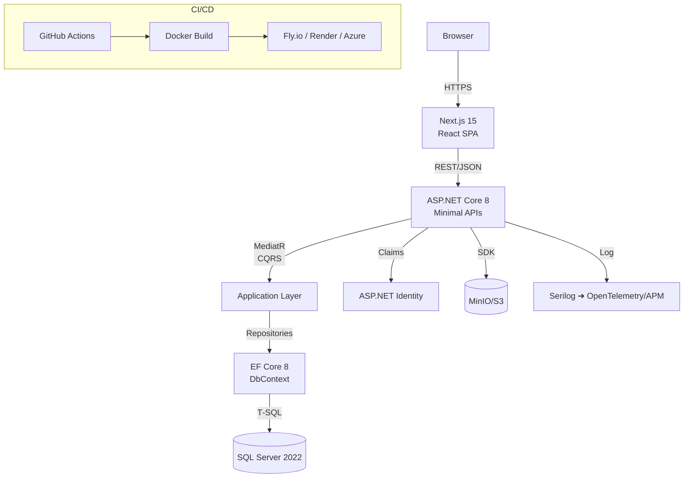
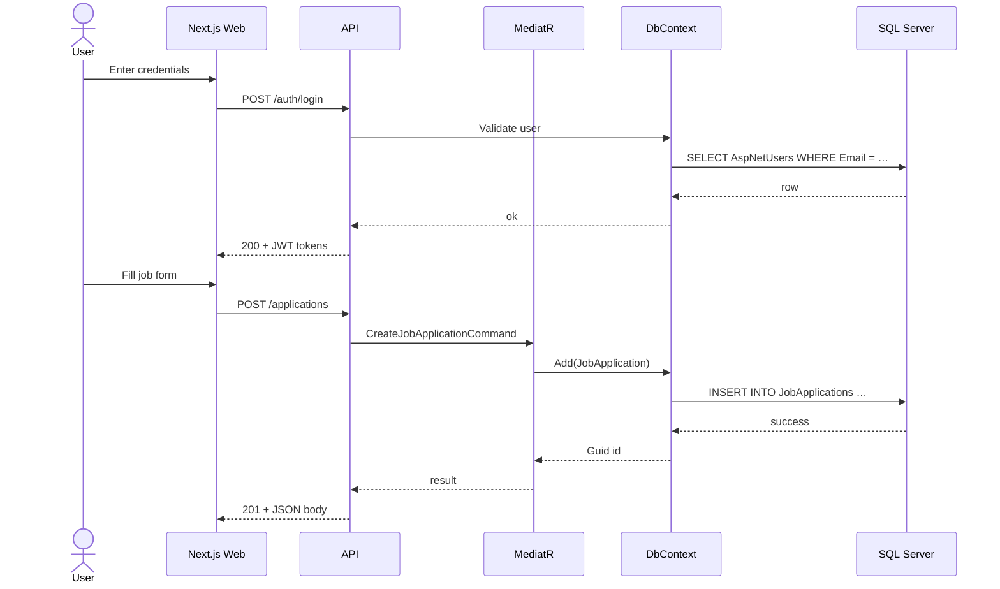
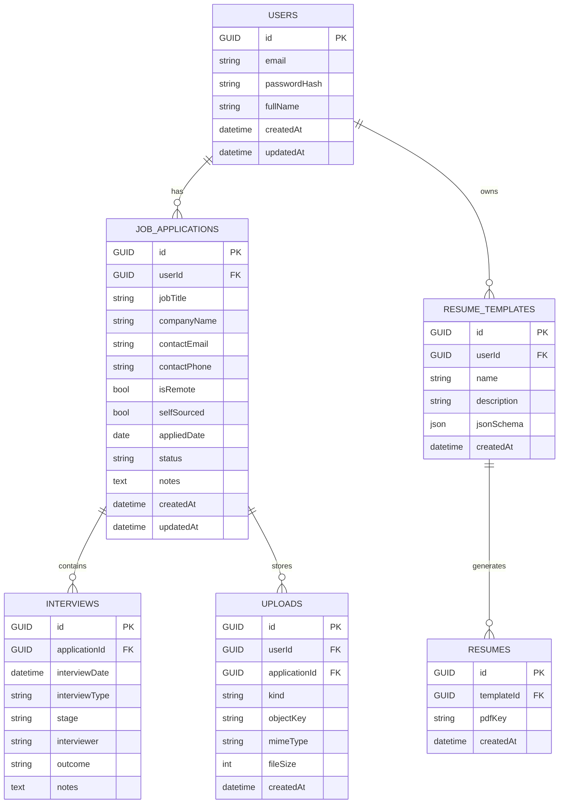

# Job Tracker – End‑to‑End Blueprint (v1.3 – **C# / SQL Server**)

> **Goal**\
> Deliver a self‑hosted web application that lets users track job applications and craft résumés/CVs—built with Clean Architecture, CQRS + MediatR, EF Core 8 + SQL Server, JWT auth, and a modern Next.js front‑end.
>
> **This version adds schematics**: an architecture flow chart, a request sequence, **and a full ER diagram** so you can visualise how every component plugs in.

---

## 0 – System‑Level Schematic

### 0.1 Architecture Flow Chart



**How it ties together**

1. **Browser** hosts the React SPA served by Next.js.
2. **Next.js** uses fetch/SWR hooks to call the **Minimal API** endpoints. Access & refresh tokens are stored in `httpOnly` cookies.
3. Each HTTP request hits `Program.cs`, flows through middleware (rate‑limiter, Serilog logger, JWT validation) and is mapped to an endpoint which immediately delegates to **MediatR**.
4. Inside **Application Layer** a *Command Handler* (mutations) or *Query Handler* (reads) runs business rules, then calls a repository abstraction.
5. Repositories are implemented with **Entity Framework Core**. They translate LINQ to T‑SQL and talk to **SQL Server 2022**.
6. When files (CVs, cover letters, job ads) are uploaded, the API issues a presigned URL. The browser uploads directly to **MinIO / S3** so the API remains stateless.
7. All logs are enriched with correlation IDs and exported via **OpenTelemetry**.
8. **GitHub Actions** build the API and front‑end. Resulting Docker images can be shipped to **Fly.io**, **Azure Container Apps**, etc.

### 0.2 Request Sequence (Login & Create Application)



---

## 1 – Technology Stack

| Layer            | Technology                                | Why It’s Here                                                 |
| ---------------- | ----------------------------------------- | ------------------------------------------------------------- |
| **API Host**     | .NET 8 (C# 12) + Minimal APIs             | Lean, testable entry layer; no MVC overhead.                  |
| **Mediator**     | MediatR 12                                | Central hub for commands/queries + pipeline behaviours.       |
| **Persistence**  | EF Core 8 • SQL Server 2022               | Strong RDBMS, LINQ, automatic migrations, local Docker image. |
| **Auth**         | ASP.NET Identity • JWT                    | Proven hashing + token issuance.                              |
| **Object Store** | MinIO/S3                                  | Offloads large files, presigned URL flow.                     |
| **Front‑end**    | Next.js 15, React 18, Tailwind, shadcn/ui | Modern UX, server components, a11y‑ready.                     |
| **CI/CD**        | GitHub Actions + Docker                   | Free runners, easy cache, artefact storage.                   |

---

## 2 – Clean Architecture Folder Map

```
job‑tracker/
├ src/
│  ├ JobTracker.Domain/         # Entities, VOs, Domain Events (NO external refs)
│  ├ JobTracker.Application/    # Commands, Queries, Handlers, Interfaces
│  ├ JobTracker.Infrastructure/ # DbContext, Repos, S3 adapter, Jwt issuer
│  ├ JobTracker.API/            # Program.cs, Endpoints, Filters, Middlewares
│  └ Shared/                    # Result<T>, Guard, Error, Behaviours
└ web/                          # Next.js front‑end
```

**Dependency Rule**: each layer only references the layer above it; the API knows nothing about EF Core, Domain knows nothing about MediatR.

---

## 3 – Database Design & Entity‑Relationship Diagram

### 3.1 ER Diagram



### 3.2 Modelling Notes

- `status` on **JobApplication** uses an `ApplicationStatus` enum (`APPLIED`, `INTERVIEWING`, `OFFER`, `DECLINED`, `HIRED`).
- **Soft‑delete**: entities implement `ISoftDelete { bool IsDeleted; DateTime? DeletedAt; }` – EF global query filter.
- **Auditing**: `ICreatedBy`, `IUpdatedBy` interfaces filled from JWT claims in `SaveChangesAsync` interceptor.

---

## 4 – CQRS & MediatR Contracts

| Name                          | Type    | Purpose                              |
| ----------------------------- | ------- | ------------------------------------ |
| `CreateJobApplicationCommand` | Command | Insert application + uploads.        |
| `UpdateJobApplicationCommand` | Command | Patch fields, enforce invariants.    |
| `DeleteJobApplicationCommand` | Command | Soft‑delete cascade.                 |
| `AddInterviewCommand`         | Command | Append interview row.                |
| `GenerateResumeCommand`       | Command | Merge template & data, save PDF.     |
| `GetJobApplicationsQuery`     | Query   | Paginated list with filters/search.  |
| `GetJobApplicationByIdQuery`  | Query   | Aggregate root + interviews/uploads. |
| …                             | …       | See spec for full list.              |

**Pipeline Behaviours**: Validation ➜ Auth ➜ Transaction ➜ Logging ➜ Caching.

---

## 5 – API Surface (REST)

| Method   | Path                            | Maps To                       | Notes                        |
| -------- | ------------------------------- | ----------------------------- | ---------------------------- |
| `POST`   | `/auth/register`                | Identity                      | Hash password, issue tokens. |
| `POST`   | `/auth/login`                   | Identity                      | Verify creds, return JWTs.   |
| `POST`   | `/auth/refresh`                 | Identity                      | Rotate refresh token.        |
| `GET`    | `/applications`                 | `GetJobApplicationsQuery`     | `?page`, `status`, `search`. |
| `POST`   | `/applications`                 | `CreateJobApplicationCommand` | —                            |
| `GET`    | `/applications/{id}`            | `GetJobApplicationByIdQuery`  | —                            |
| `PATCH`  | `/applications/{id}`            | `UpdateJobApplicationCommand` | —                            |
| `DELETE` | `/applications/{id}`            | `DeleteJobApplicationCommand` | —                            |
| `POST`   | `/applications/{id}/interviews` | `AddInterviewCommand`         | —                            |
| `PATCH`  | `/interviews/{id}`              | `UpdateInterviewCommand`      | —                            |
| `POST`   | `/uploads/presign`              | `UploadDocumentCommand`       | Returns presigned URL.       |
| `POST`   | `/resumes`                      | `GenerateResumeCommand`       | Returns PDF URL.             |
| `GET`    | `/resumes/templates`            | `GetResumeTemplatesQuery`     | —                            |

All errors comply with RFC 9457 Problem Details.

---

## 6 – Security Posture

- **Transport**: TLS 1.3, HSTS.
- **Headers**: CSP, XFO, Referrer‑Policy via custom middleware.
- **Rate‑Limiting**: `RateLimiter` (100 req / 5 min / IP) backed by Redis.
- **Input Validation**: `FluentValidation` in MediatR pipeline + XSS sanitiser.
- **Auth**: JWT 15 min, DB‑backed refresh tokens.
- **Secrets**: `.env` for local, Azure Key Vault in prod.
- **OWASP ZAP** scanning in CI.

---

## 7 – Front‑End Blueprint

```
/web/app/
├ layout.tsx             # AuthGuard + ThemeProvider
├ dashboard/page.tsx     # Job list (DataGrid)
├ applications/
│   ├ create/page.tsx    # Wizard
│   └ [id]/page.tsx      # Details (tabs: general, interviews, files)
├ resumes/
│   ├ page.tsx           # Template & résumé list
│   └ builder/page.tsx   # Drag‑and‑drop builder
└ settings/profile/page.tsx
```

- **State**: Zustand stores (`auth`, `jobApps`, `builder`).
- **Components**: `JobTable`, `ApplicationWizard`, `InterviewTimeline`, `ResumeBuilderCanvas`.
- **Styling**: Tailwind + shadcn/ui; dark‑mode via class toggle.

---

## 8 – Testing Matrix

| Layer          | Framework                          | Coverage Goal                  |
| -------------- | ---------------------------------- | ------------------------------ |
| Domain         | xUnit + FluentAssertions           | 100 % critical rules.          |
| Application    | xUnit + Moq                        | Handlers & behaviours.         |
| Infrastructure | Testcontainers‑DotNet              | Repos against live SQL Server. |
| API            | WebApplicationFactory + Playwright | 95 % endpoints (E2E).          |
| Front‑end      | Vitest + Playwright                | Component & page tests.        |

---

## 9 – Dev & CI/CD

### 9.1 Docker Compose (Local)

See § 11.1 for file.

### 9.2 GitHub Actions

Minimal CI is in § 11.3; extend with:

- **SonarCloud** scan step.
- **Playwright** E2E job (`playwright install`, `playwright test`).
- **Docker Push** (`docker build . -t ghcr.io/<user>/job‑tracker:sha‑$GITHUB_SHA`).
- **Deploy** to Fly.io via `superfly/flyctl‑actions@v2`.

---

## 10 – Runbook (tl;dr)

| Step            | Command                                         | Notes               |
| --------------- | ----------------------------------------------- | ------------------- |
| 📦 Install deps | `dotnet restore && pnpm i`                      | API & web.          |
| 🐳 Start infra  | `docker compose up -d sqlserver minio`          | DB & S3 locally.    |
| 🏗️ Migrate DB  | `dotnet ef database update`                     | Applies migrations. |
| 🚀 Run API      | `dotnet watch --project src/JobTracker.API run` | Hot reload.         |
| 🌐 Run web      | `pnpm --filter web dev`                         | Next.js dev server. |
| 🧪 Tests        | `dotnet test && pnpm vitest`                    | All layers.         |

---

## 11 – Future‑Proofing

- Swap SQL Server ➜ PostgreSQL by changing provider & connection string.
- Plug in Azure Blob Storage instead of S3 via `IFileStorage` interface.
- Add GraphQL gateway (HotChocolate) next to REST endpoints.
- Multi‑tenant soft‑delete filter by `TenantId` on every aggregate.

---

## 12 – License

MIT © 2025 Your Name

